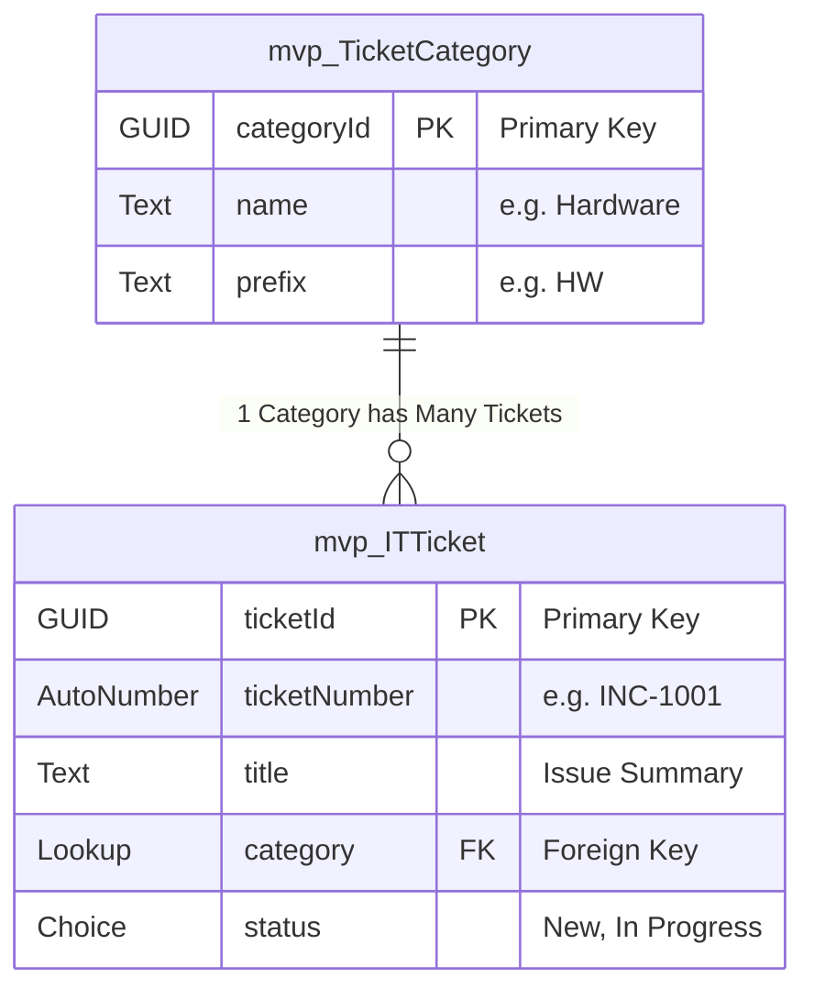

# Smart IT Support Agent: Power Platform Architecture Prototype

[]

## 🎯 Project Objective
**Role:** Power Platform Solution Architect  
**Goal:** Design a scalable **IT Service Management (ITSM)** solution architecture for enterprise ticketing.

> **⚠️ Architect's Note:**
> This repository contains a **React-based functional prototype**.  
> Due to the lack of an enterprise Microsoft 365 tenant for demonstration purposes, I architected this Single Page Application (SPA) to **simulate** the intended Dataverse Schema and Power Automate logic flow. This demonstrates the architectural design without requiring live license provisioning.

## 🛠 Tech Stack & Methodology
* **Architecture:** Designed by [Aliaksandra Navasiad] (Dataverse Schema, 1:N Relationships).
* **Logic:** Defined by [Aliaksandra Navasiad] (Power Automate Trigger/Action flow).
* **Prototype UI:** React (Tailwind CSS) - Generated via AI assistance to visualize the design specifications.

## 🏗 Architecture Design

### 1. Database Schema (Entity Relationship Diagram)
This diagram visualizes the **1:N (One-to-Many)** relationship between Categories and Tickets, which allows for scalable reporting.

### 2. Automation Logic (Pseudo-Code)
The backend logic is designed to trigger on ticket submission. You can view the visualization in the **"Logic Flow"** tab of the application.
1.  **TRIGGER:** `OnCreate` (Power App)
2.  **ACTION:** `List Rows` (Dataverse) -> Filter by Category Name to get GUID.
3.  **ACTION:** `Update Row` -> Assign Ticket to correct Support Team.
4.  **RESPONSE:** Return `TicketID` to user.

## 📸 How to Run the Prototype
If you wish to run this locally:
1.  `npm install`
2.  `npm start`
3.  Open `http://localhost:3000`

---
*Architected by [Aliaksandra Navasiad]*
